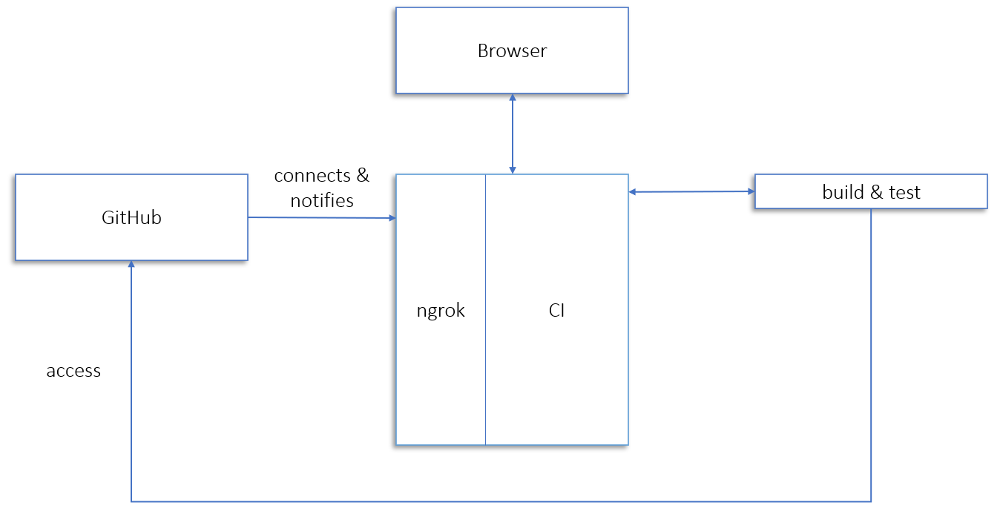

# Assignment 2 - Continuous Integration :earth_americas:

Implementation of a small continuous integration CI server containing core features of continuous integration. 

## Features of CI

The core CI features of continous integration are the following: 

1. **Compilation:**
The branch that has been changed is compiled by the CI server. The compilation is triggered as webhook. Furthermore, a static syntax check is performed.

2. **Testing:**
The CI server executes automated tests on the branch that has been changed. The testing is triggerd as webhook. 

3. **Notification:**
The CI server uses the notification mechanism of setting a [commit status](https://docs.github.com/en/github/collaborating-with-issues-and-pull-requests/about-status-checks) on the repository, using [REST API](https://docs.github.com/en/rest/reference/repos#statuses).

4. **Storing history:**
The CI server stores the history of builds, even when the server restarts. A single URL exists that lists all builds, whilst each and every build also has its own URL containing build information (commit identifier, build date and build logs).

## Motivation :man_student: :woman_student:

This is a group assignment, in the course *Software Engineering Fundamentals* at KTH, with the purpose of teaching continuous integration. The assignment is conducted in spring 2021.  

## Architecture :bricks:

The architecture of this project follows the pattern in the following figure.

### GitHub

**GitHub** is used for the repository. In this project it is used for applying [feature 2](#Features-of-CI), the notification feature, of continuous integration.

### ngrok

[**ngrok**](https://ngrok.com/docs) is used to make the local web server visible externally, on the internet. Furthermore, it is used in order to catch all HTTP traffic going via the tunnel. 

### Build and test

Whenever something is pushed to a particular branch [feature 1 and feature 2](#Features-of-CI), compilation and testing, are conducted. Compilation uses the linter [flake8](https://flake8.pycqa.org/en/latest/), and the tests are constructed using mockups. 

## Install :computer:

## Usage :books:

## Statement of Contributions :thought_balloon:

**Maja Tennander**: handling response 
**Carl Johan Freme**: documentation, setup simple Flask server 
**Anders Nilsson**: define REST API - Github - server 
**Omid Hazara**: getting and building repo in Python 
**Jennifer Lindberg**: deployment

## Further Documentation :open_file_folder:
